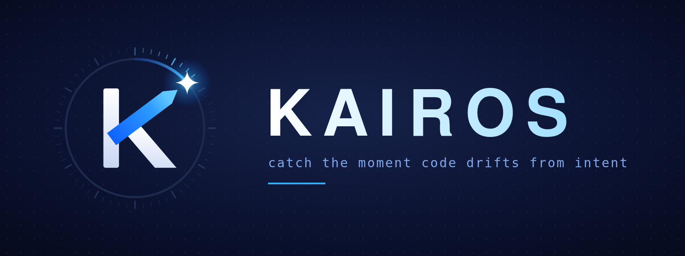

<p align="center"></p>

# Kairos

> **Catch the moment code drifts from intent.** A spec-driven continuity and intent-drift guardian built on **IBM Bob**.

Built for the [IBM Bob 2.0 Hackathon](https://lablab.ai/ai-hackathons/ibm-bob-2-hackathon) (lablab.ai, Sep 25–27, 2026). See [SPEC.md](SPEC.md) and [PLAN.md](PLAN.md).

## Status

Work in progress. See [PLAN.md](PLAN.md) for the task list.

## Development

```bash
corepack enable
pnpm install
pnpm test
pnpm build && node packages/cli/dist/index.js --help
```

Requires Node ≥ 20 (Node ≥ 24 for Bob Shell).

## IBM Bob usage

Bob custom modes live in [.bob/custom_modes.yaml](.bob/custom_modes.yaml). Evidence of every Bob task is in [bob_sessions/](bob_sessions/).

## License

MIT
