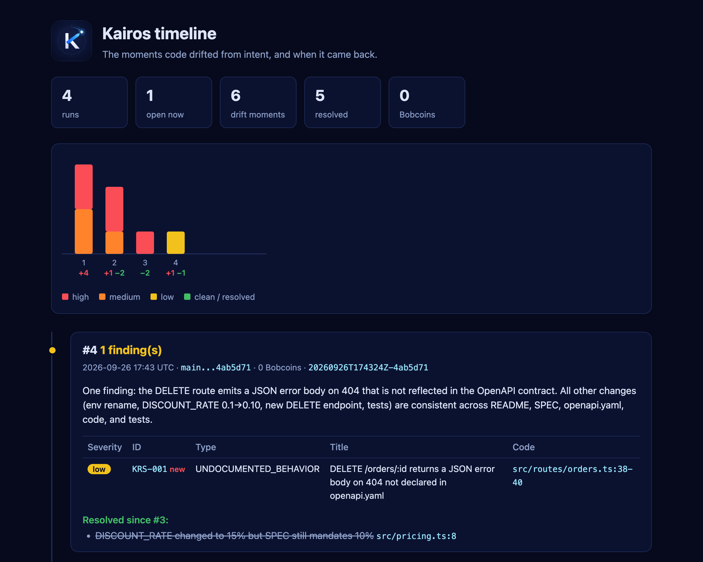
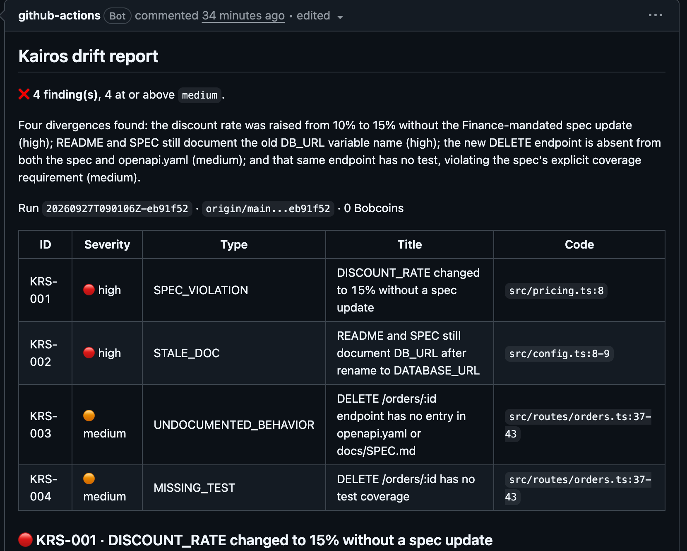
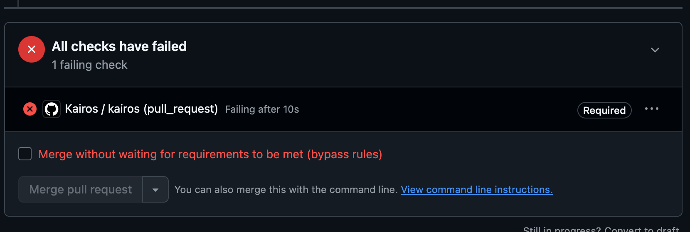
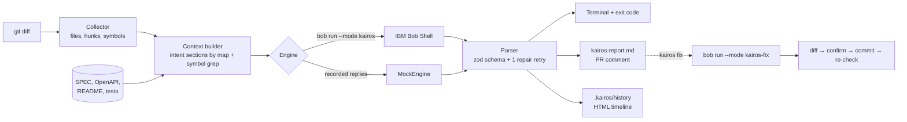

<p align="center"></p>

# Kairos

> **Catch the moment code drifts from intent.** An intent-drift guardian and living-docs workflow, powered by **IBM Bob**.

Built for the [IBM Bob 2.0 Hackathon](https://lablab.ai/ai-hackathons/ibm-bob-2-hackathon) (lablab.ai, Sep 25–27, 2026) by a solo developer.

Code changes every day. The documents that say what the code *should* do (specs, API contracts, READMEs, tests) rarely keep up. Linters check syntax and tests check behaviour someone remembered to write. **Nothing checks that a change still matches the intent.** Kairos does, on every commit, push and pull request:

1. takes the diff,
2. picks the matching sections of your intent sources (SPEC, OpenAPI, README, ADRs, tests),
3. asks **IBM Bob**, running in a dedicated `kairos` custom mode, to compare implementation and intent,
4. reports every divergence with evidence on both sides (file:line), severity and a proposed resolution,
5. and on request lets Bob **fix it**: update the doc, add the missing test, or put the code back in line with the spec.

Kairos does not assume the code is right. For every finding it asks which side is the source of truth and fixes the other one.

## See it in 60 seconds (offline, no Bob needed)

The mock engine replays replies recorded from real IBM Bob runs, so the whole story runs for free.

```bash
corepack enable && pnpm install && pnpm build
alias kairos="node $PWD/packages/cli/dist/index.js"

demo/scripts/reset.sh --install          # throwaway demo repo: demo/.work/orders-api
demo/scripts/drift-a.sh                  # A: discount 10% -> 15% in code, SPEC still says 10%
demo/scripts/drift-b.sh                  # B: new DELETE /orders/:id, no OpenAPI entry, no test
demo/scripts/drift-c.sh                  # C: DB_URL renamed to DATABASE_URL, README still says DB_URL
cd demo/.work/orders-api

kairos check --engine mock               # 4 findings, exit 1 (blocks the push / PR)
kairos fix --id KRS-002 --engine mock --yes                              # C: docs follow the code
kairos fix --id KRS-002 --truth code --engine mock --yes                 # B: document DELETE + 2 tests
kairos fix --id KRS-001 --truth intent --allow-code --engine mock --yes  # A: the spec wins, code back to 10%
kairos report --html                     # kairos-timeline.html
```

Drop `--engine mock` (and `--yes`) to run the same thing on live IBM Bob. Requires Node ≥ 20 (Node ≥ 24 for Bob Shell).

```text
$ kairos check
KRS-001  high    SPEC_VIOLATION         src/pricing.ts:8            DISCOUNT_RATE changed to 15% without a spec update
KRS-002  high    STALE_DOC              src/config.ts:8-9           README and SPEC still document DB_URL after rename to DATABASE_URL
KRS-003  medium  UNDOCUMENTED_BEHAVIOR  src/routes/orders.ts:37-43  DELETE /orders/:id endpoint has no entry in openapi.yaml or docs/SPEC.md
KRS-004  medium  MISSING_TEST           src/routes/orders.ts:37-43  DELETE /orders/:id has no test coverage

4 finding(s), 4 at or above medium.
```

Full Markdown report (the same text becomes the PR comment): [demo/sample-report.md](demo/sample-report.md).

<p align="center"></p>

*The timeline of that run. #1: four drifts. Each `kairos fix` commits and re-checks. After fix B, Bob noticed its own new DELETE route returns a JSON 404 body that openapi.yaml does not declare: a `low` finding, below `failOn`, so the check passes and the finding stays visible.*

### On a pull request

The GitHub Action posts the same report on the PR ([live example](https://github.com/OnixFireOne/kairos-demo-orders-api/pull/2)) and, with the check marked as required, blocks the merge:

<p align="center"></p>
<p align="center"></p>

## What's in the box

| Command | What it does |
|---|---|
| `kairos init` | `.kairos/config.yaml`, the Bob custom modes, `docs/kairos/` living docs, pointers in `CLAUDE.md`/`AGENTS.md`, a `post-commit` hook |
| `kairos doctor` | checks that live runs can work: IBM Bob Shell on PATH and `BOB_API_KEY` set (also printed at the end of `init`) |
| `kairos check` | diff → intent context → Bob → Drift Report (terminal, `kairos-report.md`, `.kairos/history/*.json`); exit 1 at or above `failOn` |
| `kairos fix --id <ID>` | Bob resolves one finding (`--truth intent\|code`; docs and tests only unless `--allow-code`), you confirm the diff, Kairos commits, logs the decision and re-checks |
| `kairos report [--html]` | drift history; `--html` writes a single self-contained timeline page (no scripts, opens offline) |
| `kairos hook install` | `pre-push` hook: drift blocks the push, a tool failure never does |
| `action.yml` | GitHub Action: runs `check` on every pull request and posts or updates one PR comment ([example workflow](demo/orders-api/.github/workflows/kairos.yml)) |
| `kairos session "<task>"` | runs a dev task through Bob in `kairos-dev` mode, sums turns and Bobcoins per session, writes a handoff over budget |
| `kairos handoff` | Bob drafts `docs/kairos/HANDOFF.md` from git log, PLAN statuses and the last check |

Finding types: `SPEC_VIOLATION`, `STALE_DOC`, `UNDOCUMENTED_BEHAVIOR`, `MISSING_TEST`, `ADR_CONFLICT`. `check` also flags stale living docs (code changed, `PLAN`/`PROGRESS` did not).

## How Kairos uses IBM Bob

Bob is the engine, not an add-on. Every check and every fix is a headless Bob Shell run:

```bash
bob run --mode kairos --format stream-json --max-cost <N> --max-turns <N>   # prompt on stdin
```

- **Four custom modes** in [.bob/custom_modes.yaml](.bob/custom_modes.yaml), shipped by `kairos init`, usable in Bob IDE (`/kairos`) and headless:
  - `kairos`: read-only analyst. Compares the diff with the intent excerpts, reads the code around them, returns a JSON Drift Report with evidence on both sides.
  - `kairos-fix`: may edit only docs, specs, contracts and tests (`.md`, `.yaml`, `.json`, `*.test.ts`, enforced by the mode's `fileRegex`), for one finding.
  - `kairos-fix-code`: may edit code too; used only with `--allow-code` when the intent is the truth.
  - `kairos-dev`: works on a task and keeps `PLAN`/`PROGRESS`/`DECISIONS`/`HANDOFF` current; recommends a new chat only when it pays off.
- **Live progress.** Kairos reads Bob's `stream-json` events as they arrive and shows what Bob is doing in the terminal (`⠹ IBM Bob · reading src/pricing.ts · 6 tool calls · 8s`); silent in CI and hooks.
- **Whole-repo understanding.** Kairos sends a compact prompt (diff + the selected intent sections), and Bob opens the files it needs itself: 8 tool calls on the A/B/C check, 1 on the clean control commit.
- **Document understanding.** Markdown specs, OpenAPI YAML, READMEs and tests are the intent side of every comparison.
- **Agent mode for fixes.** Bob edits the files, runs the demo tests, and Kairos shows the diff before committing.
- **Cost control.** `--max-cost` and `--max-turns` per command, a prompt-hash cache (a repeated check costs 0), and deterministic context selection so Bob sees only the relevant sections.
- **The same path in CI.** The GitHub Action runs `kairos check`; with `engine: bob` it calls Bob Shell with `BOB_API_KEY` from a repository secret.

Evidence of every Bob task (screenshots of the consumption summaries, raw JSON and Bob Shell logs): [bob_sessions/](bob_sessions/README.md).

## Measured on the demo (real IBM Bob runs)

| Metric | Result |
|---|---|
| Seeded drifts caught | **3/3** (A, B, C; plus the missing test for B), exact file:line evidence on both sides |
| False positives on the control commit (doc typo fix) | **0** |
| Cost of one check | **0.026–0.180 Bobcoins** (6 real checks, mean 0.108); cached rerun **0** |
| Time of one check | **20–35 s** |
| Time to resolve a drift with `kairos fix` | C (README + SPEC): **11 s**, 0.058 · B (SPEC + OpenAPI + 2 tests): **26 s**, 0.138 · A (code + 3 test expectations): **28 s**, 0.221 |
| Whole loop: check → 3 fixes → re-checks → pass | **5.5 min** wall clock including human confirmations and one capped retry, **1.12 Bobcoins** |
| Session restart cost (this repo) | `HANDOFF.md` (3.8k chars) + one task file (2–4k) instead of SPEC + PLAN + all task files (~70k chars) |
| Total Bobcoins for the whole hackathon | **6.38 / 40** |

Sources: Bob tasks 04–13 in [bob_sessions/README.md](bob_sessions/README.md) (durations from the Bob Shell logs). We did not time a manual fix with a stopwatch, so there is no manual baseline in this table.

## Living docs: continuity between sessions

Kairos also turns a spec-driven way of working with coding agents into a tool. `kairos init` creates:

| `docs/kairos/` | Holds | Written by |
|---|---|---|
| `SPEC.md` | intent: what, why, rules | human + Bob |
| `PLAN.md` | tasks with `[ ] [~] [x]` | Bob in `kairos-dev` mode |
| `PROGRESS.md` | append-only commit log | `post-commit` hook (no LLM) |
| `DECISIONS.md` | decisions, including every `kairos fix` resolution | Bob / `kairos fix` |
| `tasks/TNN-*.md` | one file per task: goal, spec, decisions, problems, result | Bob |
| `HANDOFF.md` | state, next step, gotchas for the next session | Bob / `kairos handoff` |

Pointers in `CLAUDE.md`, `AGENTS.md` and the `kairos-dev` mode make every agent (Bob, Claude Code, Codex) read `HANDOFF.md` first. A new chat starts with "continue" and nothing else. Unlike automatic context compaction, these notes are explicit, reviewed in git, shared by every agent, and checked for staleness by `kairos check`.

**Dogfooding.** Kairos was built this way: [HANDOFF.md](HANDOFF.md), [PLAN.md](PLAN.md) with statuses and one file per task in [docs/tasks/](docs/tasks/README.md). Every new session started from "continue".

## Architecture



TypeScript (strict), Node 20+, `commander`, `zod`, `execa`, `fast-glob`, `yaml`; 161 `vitest` tests, all against the mock engine. Code: [packages/cli/src](packages/cli/src). Product spec: [SPEC.md](SPEC.md).

## Use it in your repo

Kairos is not on npm yet; build it from this repo once (Node 20+), then run it inside your project:

```bash
git clone https://github.com/OnixFireOne/ibm-kairos && cd ibm-kairos
corepack enable && pnpm install && pnpm build
alias kairos="node $PWD/packages/cli/dist/index.js"   # add to ~/.zshrc to keep it
```

```bash
cd <your-repo>
kairos init                  # config, Bob modes, docs/kairos/, agent pointers, post-commit hook; then checks Bob Shell + BOB_API_KEY
kairos doctor                # re-check the environment any time (exit 1 if something is missing)
# edit .kairos/config.yaml: base branch, intent globs, section map, failOn, cost caps
kairos check                 # needs Bob Shell (`bob`) and BOB_API_KEY (Inference scope) for headless runs
kairos hook install          # optional: check before every push
```

Live runs need [IBM Bob Shell](https://bob.ibm.com/docs/shell/getting-started/install-and-setup) on PATH and an IBM Bob API key with the Inference scope in `BOB_API_KEY` (shell profile or CI secret, never in the committed config). `kairos doctor` tells you what is missing.

On GitHub, copy [demo/orders-api/.github/workflows/kairos.yml](demo/orders-api/.github/workflows/kairos.yml) (`uses: OnixFireOne/ibm-kairos@main`, `fetch-depth: 0`, `pull-requests: write`). It defaults to `engine: mock`; for live Bob install Bob Shell in an earlier step and set `engine: bob` and `bob-api-key: ${{ secrets.BOB_API_KEY }}`.

The check reports drift; blocking is a repository policy that a workflow cannot set for itself. To block merges on drift, mark the `kairos` check as required: Settings → Branches (or Rules → Rulesets) → rule for `main` → *Require status checks to pass* → `kairos`.

## Limitations and what's next

- The demo is JS/TS; the collector's symbol extraction is regex-based. Next: more languages.
- `kairos session` and `kairos handoff` are covered by tests against the mock engine but have not been run on live Bob yet.
- Next: nudges inside the IDE at the moment of the edit, fanning a large check out to Bob subagents per intent area, an org-wide drift dashboard.

## How it was built

One developer, two AI tools with distinct roles:

- **Claude Code** wrote most of the CLI, the contracts and the tests, and orchestrated the work.
- **IBM Bob** is the product's runtime engine and also implemented selected modules (the diff collector, intent context selection) against tests written first, called headless through [scripts/bob-task.sh](scripts/bob-task.sh), the same path `kairos check` uses. So Bob's integration was exercised from day 1.

## License

[MIT](LICENSE)
